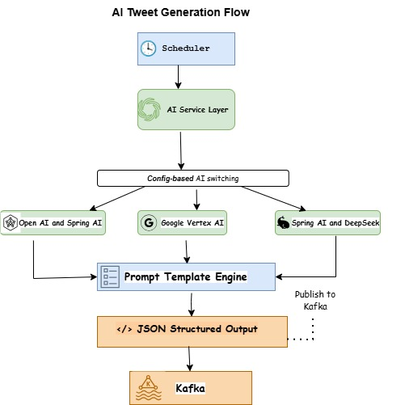

# Digital Wallet — Microservices Platform (Spring Boot + Spring Cloud)

A production-grade **digital wallet** platform built with **Spring Boot** and **Spring Cloud**, featuring **event-driven architecture** with **Apache Kafka**, **CQRS with Elasticsearch**, **Keycloak (OAuth2/OIDC + JWT)** security, **API Gateway**, **service discovery**, **observability (Prometheus/Grafana)**, **centralized logging (ELK)**, and **distributed tracing (Zipkin/Sleuth or Micrometer Tracing)**.

##  Project Status

This project is currently under active development as part of my microservices learning journey.

 Implemented:
- AI-powered tweet generation microservice
- Multi-provider AI integration (OpenAI, Google Vertex AI, DeepSeek)
- Template-based prompt generation
- Structured JSON output using schema enforcement
- Scheduled data generation

 In progress:
- Kafka integration (event streaming)
- API Gateway (Spring Cloud Gateway)
- Service discovery (Eureka)
- Authentication & Authorization (Keycloak)
- CQRS with Elasticsearch
- Observability (Prometheus, Grafana)


---

##  AI Tweet Generation Service

This is the first implemented microservice in the system.

### Features:
- Supports multiple AI providers:
  - OpenAI
  - Google Vertex AI
  - DeepSeek
- Config-driven provider switching
- Prompt template engine
- JSON schema-based output
- Scheduled generation 

### Example Flow:

Scheduler → AI Service →   AI Provider → Prompt Templat →e-> JSON Output



##  Key Features

> ⚠️ Note: Full architecture is planned and partially implemented.  
> Currently, the AI microservice is completed and other components are under development.

---

##  Architecture Overview

**Flow**
1. Client calls `api-gateway`
2. Gateway routes to services through Eureka discovery
3. Services persist to **PostgreSQL** (write model)
4. Services publish domain events to **Kafka**
5. `query-service` (or read-model projector) consumes events and updates **Elasticsearch**
6. Monitoring & tracing via Prometheus/Grafana/Zipkin, logs via ELK


```text
                ┌───────────────┐
                │   API Gateway │
                │ Spring Cloud  │
                └───────┬───────┘
                        │
        ┌───────────────┼────────────────┐
        │               │                │
        ▼               ▼                ▼
 ┌────────────┐ ┌──────────────┐ ┌──────────────┐
 │ Auth       │ │ Wallet       │ │ Transaction  │
 │ Service    │ │ Service      │ │ Service      │
 │ Keycloak   │ │ Postgres     │ │ Postgres     │
 └─────┬──────┘ └──────┬───────┘ └──────┬───────┘
       │                │                │
       │                │                │
       │           Kafka Events          │
       │                │                │
       ▼                ▼                ▼
 ┌──────────────┐ ┌──────────────┐ ┌──────────────┐
 │ Analytics    │ │ Notification │ │ Search       │
 │ Service      │ │ Service      │ │ Service      │
 │ Postgres     │ │ Kafka        │ │ Elasticsearch│
 └──────────────┘ └──────────────┘ └──────────────┘
